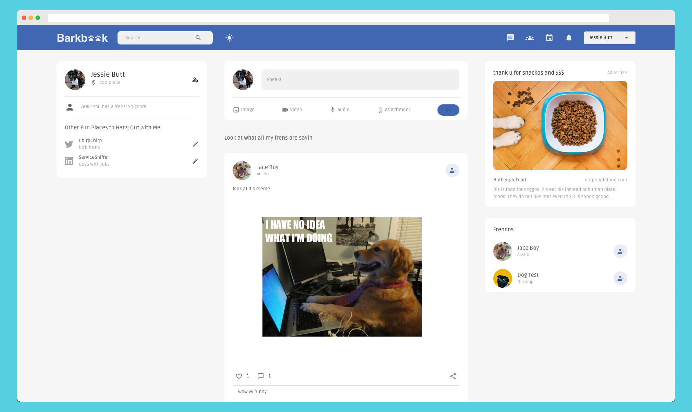
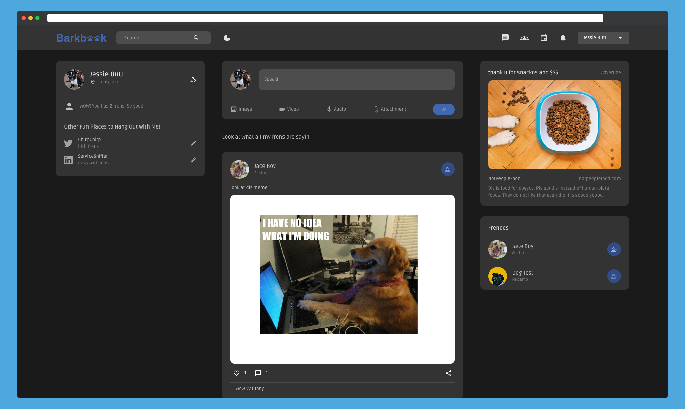

# Barkbook (previously Borker)

Social media. But, like, for dogs.

## About

This is my final project for the Nucamp Nucamp Full Stack Web + Mobile Development Honors program.

Light mode:


Dark mode:


## Getting Started

Navigate to the server directory and run:

```
$ npm install
$ npm start
```

By default, the server will run on `localhost:3001`.

Repeat for the client directory. By default the client will run on `localhost:3000`.

## Development Dependencies

### System/Environment

- [NPM](https://www.npmjs.com/)
- [Create React App](https://create-react-app.dev/)

### Frontend

- [React](https://reactjs.org/)
- [Material UI](https://mui.com/)
- [Material Icons](https://mui.com/material-ui/material-icons/)
- [React Dropzone](https://github.com/react-dropzone/react-dropzone)

### Backend

- [MongoDB](https://mui.com/)
- [Express](https://mui.com/material-ui/material-icons/)
- [Morgan](https://github.com/expressjs/morgan)
- [Node](https://nodejs.org/en/)

### Form Handling and Validation

- [Formik](https://formik.org/)
- [Yup](https://github.com/jquense/yup)
- [Multer](https://github.com/expressjs/multer)

### State Management and Routing

- [Redux Toolkit](https://redux-toolkit.js.org/)
- [React Router](https://github.com/remix-run/react-router#readme)
